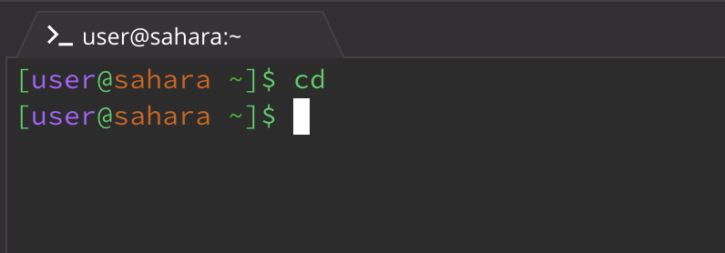
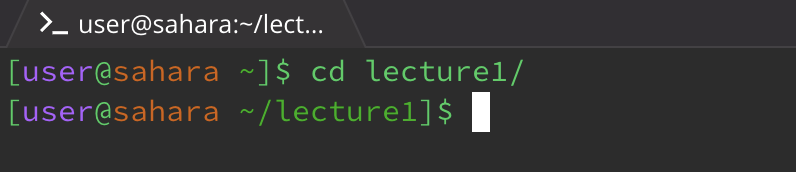
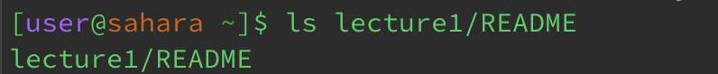
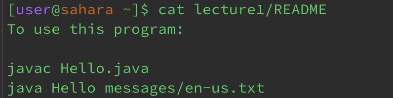

# Lab Report 1 - Remote Access and FileSystem 

* **`cd`**
  1. `cd` with no argument
     
  2. `cd` with path to directory argument
     
  3. `cd` with path to file argument
      
     
  
* **`ls`**
  1. `ls` with no argument
     
  2. `ls` with path to directory argument
     
  3. `ls` with path to file argument
     

  
* **`cat`**
  1. `cat` with no argument
     
  2. `cat` with path to directory argument
     
  3. `cat` with path to file argument
     
     
