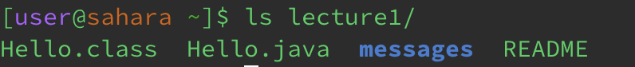
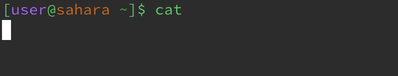

# Lab Report 1 - Remote Access and FileSystem 

* **`cd`**
  1. `cd` with no argument
     
       The working directory when this command ran is `/home`. `cd` means change directory and since there were no arguments, the current directory remained the same. This output is not an error.
  3. `cd` with path to directory argument
     
       The working directory when this command ran is `/home/lecture1`. The filesystem has a file path that changed the current directory to the lecture1 directory. Since lecture1 was passed as an argument, it can be seen that the output indicates that we are in the lecture1 directory. This output is not an error. 
  5. `cd` with path to file argument
      
       The working directory when this command ran is `/home/lecture1/README`. The filesystem has a file path which caused the output to display an error. It is an error because `cd` changes the directory, it cannot change the directory to a file. 
     
  
* **`ls`**
  1. `ls` with no argument
     
  2. `ls` with path to directory argument
     
  3. `ls` with path to file argument
     

  
* **`cat`**
  1. `cat` with no argument
     
  2. `cat` with path to directory argument
     
  3. `cat` with path to file argument
     
     
