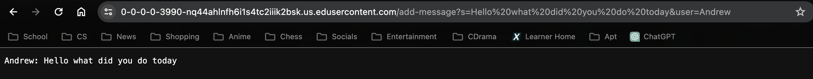

# Lab Report 2 - Servers and SSH Keys 

**Code for ChatServer** 

```
import java.io.IOException;
import java.net.URI;
import java.util.ArrayList;
import java.util.*;  
class Handler implements URLHandler {
ArrayList<String> chat = new ArrayList<String>();
    public String handleRequest(URI url) {   
            if (url.getPath().contains("/add-message")) {
                String[] parameters = url.getQuery().split("[=&]");
                if (parameters[0].equals("s") && parameters[2].equals("user")) {
                    String a = (parameters[3]);
                    String b = (parameters[1]); 
                    String c = a + ":" + " " + b; 
                    chat.add(c); 
                    String d = "";
                    for(int i =0; i < chat.size(); i++)
                    {
                        d += chat.get(i) + "\n";   
                    }
                    d = d.replaceAll("\\+", " "); 
                    //System.out.println(d);
                    return d;
                }
            }
           return "404 Not Found!"; 
        }
    }
class NumberServer {
    public static void main(String[] args) throws IOException {
        if(args.length == 0){
            System.out.println("Missing port number! Try any number between 1024 to 49151");
            return;
        }
        int port = Integer.parseInt(args[0]);
        Server.start(port, new Handler());
    }
}
```
**Screenshots of /add-message**




