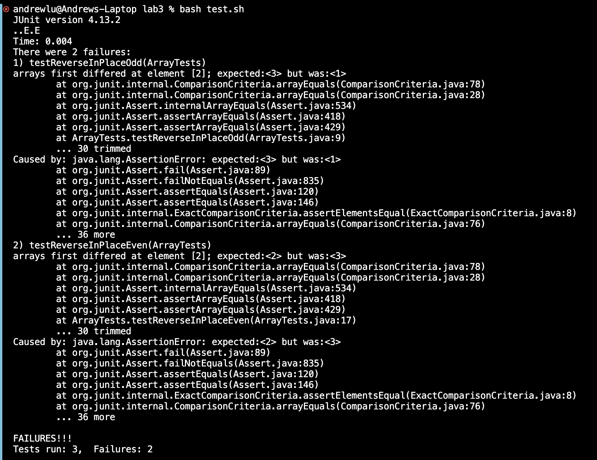

# Lab Report 3 - Bugs and Commands #

## Reverse Array Method ## 
**Failure Inducing Test Cases**
```
@Test 
	public void testReverseInPlaceOdd() {
    int[] input1 = { 3,2,1 };
    ArrayExamples.reverseInPlace(input1);
    assertArrayEquals(new int[]{ 1,2,3 }, input1);
	}

  @Test 
  public void testReverseInPlaceEven()
  {
    int[] input1 = {1,2,3,4}; 
    ArrayExamples.reverseInPlace(input1);
    assertArrayEquals(new int[] {4, 3,2,1}, input1);
  }
```
**Test Case without Failure**
```
@Test 
  public void testReverseInPlace()
  {
    int[] input1 = {1}; 
    ArrayExamples.reverseInPlace(input1);
    assertArrayEquals(new int[] {1}, input1);
  }
```
**JUnit Test Using Bash**
```
set -e 
javac -cp .:lib/hamcrest-core-1.3.jar:lib/junit-4.13.2.jar *.java                              
java -cp .:lib/hamcrest-core-1.3.jar:lib/junit-4.13.2.jar org.junit.runner.JUnitCore ArrayTests
```
**Output**



**Reverse Array Code with Bug**
```
static void reverseInPlace(int[] arr) {
    for(int i = 0; i < arr.length; i += 1) {
      arr[i] = arr[arr.length - i - 1];
    }
  }
  ```

**Reverse Array Code without Bugs**
```
static void reverseInPlace(int[] arr) {
    for(int i = 0; i < arr.length/2; i ++) 
    {
      int temp = arr[i]; 
      arr[i] = arr[arr.length - i - 1];
      arr[arr.length - i - 1] = temp; 
    }
  }
```
In the original code, you are not able to directly swap the values of two array indexes. Thus, a temp variable was created storing the value of the first index. Since the first index is now empty, the last value of the array is placed into it. The last index is then set to the value in temp. Since two indexes are being changed every iteration, the maximum amount of iterations should be length/2. 

**`find` Command**


**`find technical/government/About_LSC -type f -delete` command**
```
andrewlu@Andrews-Laptop docsearch % ls technical/government/About_LSC
CONFIG_STANDARDS.txt
Comments_on_semiannual.txt
LegalServCorp_v_VelazquezDissent.txt
LegalServCorp_v_VelazquezOpinion.txt
LegalServCorp_v_VelazquezSyllabus.txt
ODonnell_et_al_v_LSCdecision.txt
ONTARIO_LEGAL_AID_SERIES.txt
Progress_report.txt
Protocol_Regarding_Access.txt
Special_report_to_congress.txt
State_Planning_Report.txt
State_Planning_Special_Report.txt
Strategic_report.txt
commission_report.txt
conference_highlights.txt
diversity_priorities.txt
reporting_system.txt
andrewlu@Andrews-Laptop docsearch % find technical/government/About_LSC -type f -delete
andrewlu@Andrews-Laptop docsearch % ls technical/government/About_LSC
```
```
Andrews-Laptop:technical andrewlu$ ls
911report       biomed          government      plos            test
Andrews-Laptop:technical andrewlu$ find . -delete 
Andrews-Laptop:technical andrewlu$ ls
```
This command line option traverses through all found files/directories and deletes them. As seen in the first code block, all files were deleted from the `About_LSC` directory by the `-type f`, while the second code block shows all files and directories deleted from `technical` directory. 

Source - https://ss64.com/mac/find.html

**`find . -type d empty` command**

```
andrewlu@Andrews-Laptop technical % find . -type d -empty 
./empty directory
```
```
andrewlu@Andrews-Laptop plos % find . -type f -empty
./empty file
```
This command line option finds all empty files/directories. In the first code block, an empty directory was created and by using `-type d` it searches up empty directories. While in the second code block, using `-type f` searches up empty files. 

Source -https://ss64.com/mac/find.html

**`find . -type d -mtime 0` command**

```
andrewlu@Andrews-Laptop technical % find . -type d -mtime 0
.
./government
./government/About_LSC
./government/Env_Prot_Agen
./government/Alcohol_Problems
./government/Gen_Account_Office
./government/Post_Rate_Comm
./government/Media
./empty directory 
./plos
./biomed
./911report
./just created folder
```
```
andrewlu@Andrews-Laptop madeNow % find . -mtime 0
.
./created now
```
This command line option searches for files/directories modified or created within the last 24 hours. 

Source - https://ss64.com/mac/find.html

***`find . -type` command**
```
andrewlu@Andrews-Laptop technical % find . -type d 
.
./government
./government/About_LSC
./government/Env_Prot_Agen
./government/Alcohol_Problems
./government/Gen_Account_Office
./government/Post_Rate_Comm
./government/Media
./empty directory 
./plos
./madeNow
./biomed
./911report
```
```
andrewlu@Andrews-Laptop 911report % find . -type f 
./chapter-13.4.txt
./chapter-13.5.txt
./chapter-13.1.txt
./chapter-13.2.txt
./chapter-13.3.txt
./chapter-3.txt
./chapter-2.txt
./chapter-1.txt
./chapter-5.txt
./chapter-6.txt
./chapter-7.txt
./chapter-9.txt
./chapter-8.txt
./preface.txt
./chapter-12.txt
./chapter-10.txt
./chapter-11.txt
```
This command line option searches up the file of the specific type. `-type f` would mean files while `-type d` would refer to directories. 

Source - https://ss64.com/mac/find.html


