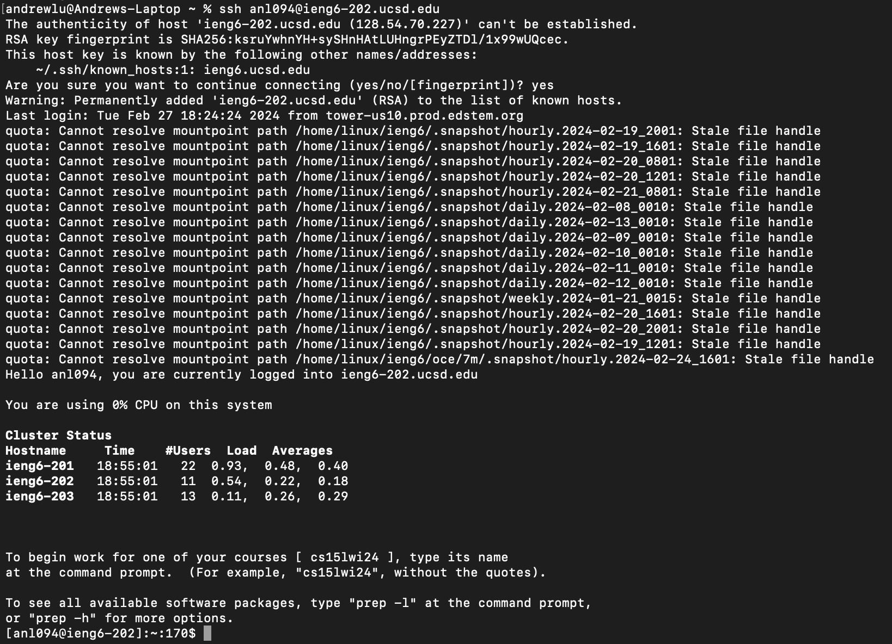
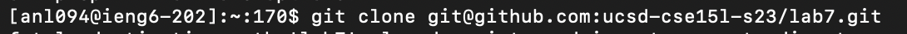
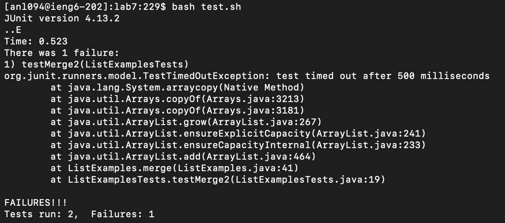
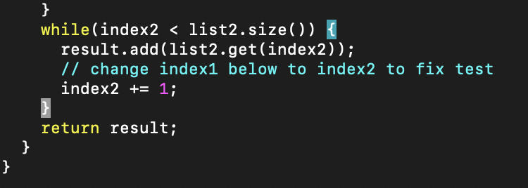
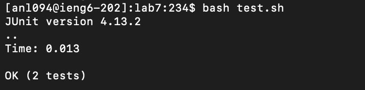
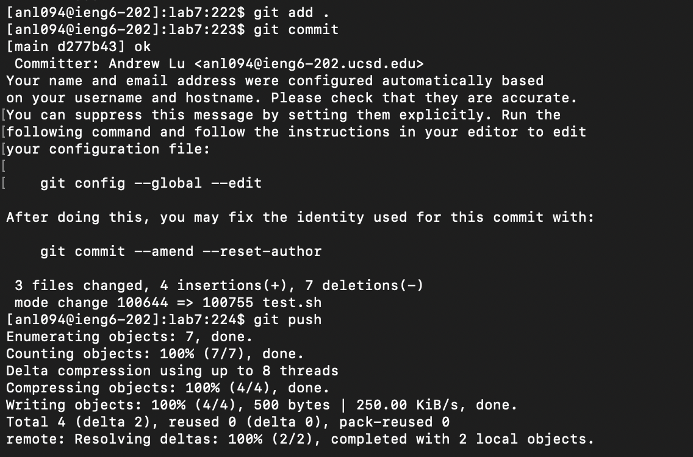

# Lab Report 4 - Vim #

## Step 4 ## 

Keys pressed:`ssh anl094@ieng6-202.ucsd.edu` -> `<enter>` -> `yes` -> `<enter>` 
Logged into ieng6-202. 

## Step 5 ## 

Keys pressed: `git clone` -> `<cmd c + cmd v> git@github.com:ucsd-cse15l-s23/lab7.git` -> `<enter>`
Copy and paste the SSH link for the forked Github, and git cloned into server. 

## Step 6 ## 

Keys pressed: `cd lab7` -> `<enter>` -> `bash test.sh` -> `<enter>` 
Changed the current directory into lab 7 and then ran the test script. 

## Step 7 ##

Keys pressed: `cd ..` -> `<enter>` -> `vim lab7` -> `<enter>` -> `<down> x7` -> `<enter>` -> `<down> x15` -> `<right> x10` -> `<a>` -> `<del>` -> `<2>` -> `<esc>` -> `<:w>` -> `<:wq>` 
Changed out of the current directory, into the home directory and opened the file Lab7 in Vim. Then by using the down keys, navigated to ListExamples.java folder and navigated down to the function with the error in it. Using a (append) I edited index1 to index2 and saved the file by using :w and exited back to the terminal using :wq. 

## Step 8 ## 

Keys pressed: `cd lab7` -> `<enter>` -> `<tab>` ->`javac ListExamples.java` -> `<enter>` -> `bash test.sh` 
Changed current directory to lab7, then compiled using javac, used tab to type out ListExamples.java then ran the test script. 

## Step 9 ## 

Keys pressed: `git add .` -> `<enter>` -> `git commit` -> `<enter>` -> `ok` -> `<enter>` -> `git push` -> `<enter>`
Git add . stages the file for committing, git commit saves the changes in the staging area, ok is the commit message to remember what is most important about the change and git push pushes the file to GitHub. 

