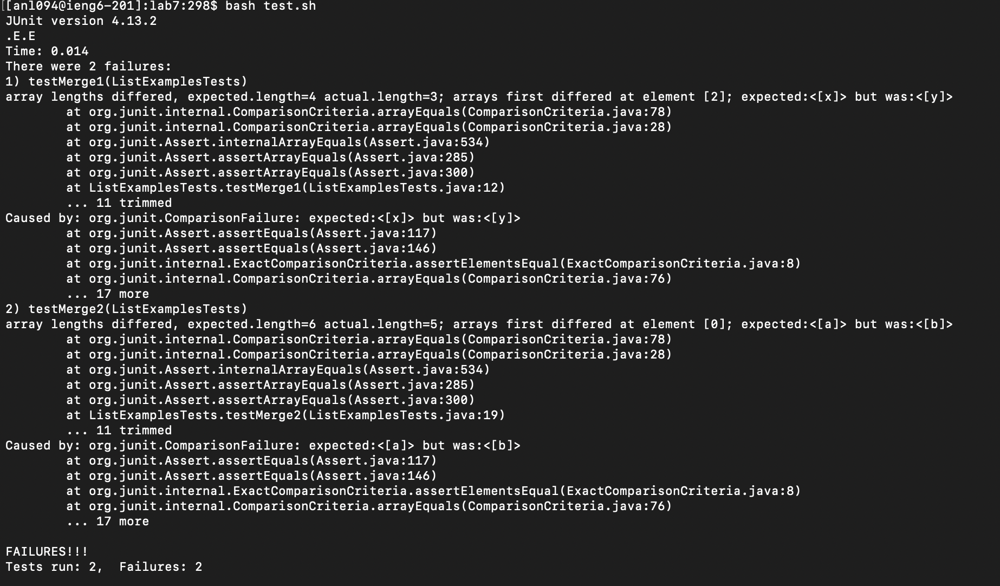
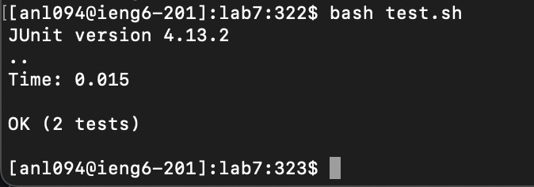
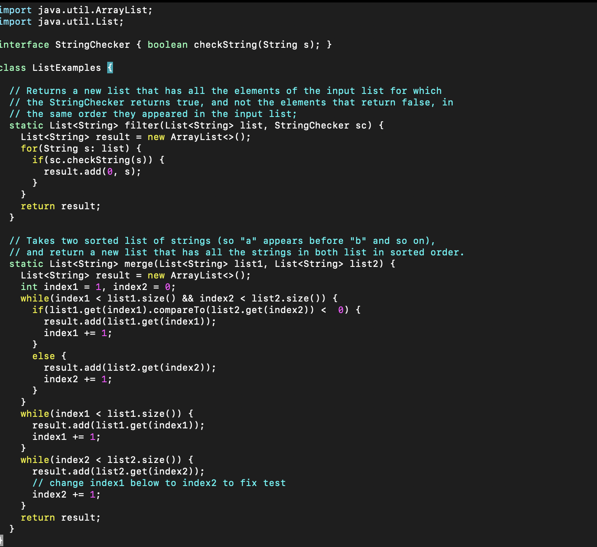

# Lab Report 5 - Putting it all Together # 

Hello, I was trying to test out my merge list code but I ran into an error when running my tests and now I am stuck. The test says it expects the first element of list one, however it gets the second element instead. 

Hey, it looks like it is not fully counting all the elements in the list. You can see that it says expected.length[4], then actual.length[3]. Maybe try setting your count variable as 0 for each list. 

Thanks, it seemed that I started the iteration for my first list at 1 instead of 0, so all the elements at index 0 were being skipped. 

Directory structure needed 
`-lab7 
    -ListExamplesTests.java
    -ListExamples.java
    -test.sh
  -lib
  `
File before fix 

File after fix 

Command Line 
`cd lab7` -> `bash test.sh` 

To fix this bug, index1 is to be set at 0 so the first element of the list is checked. If index1 is set to 1, then the first element gets skipped, and starting from the second element is what gets checked. 

One of the things I learned in lab is being able to edit files using vim. Being able to edit in Vim. Also debugging in Vim becomes useful when one is coding in Vim. Commands such as stop in or stop at help when debugging long problems with multiple lines of code.  

